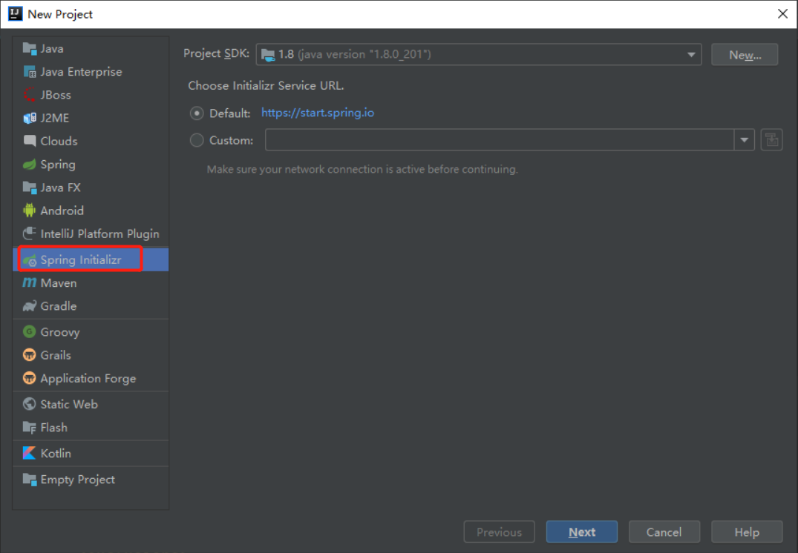

## 1. 快速创建SpringBoot项目

在 **IEDA** 中只需点击 **New Project** 选择 **Spring Initializr** 随后填写相应项目名称即可快速创建




## 2. 第一个Hello World

```java
package cn.lksun.springboot.Controller;

import org.springframework.stereotype.Controller;
import org.springframework.web.bind.annotation.RequestMapping;
import org.springframework.web.bind.annotation.RequestMethod;
import org.springframework.web.bind.annotation.ResponseBody;

@Controller
@ResponseBody
public class HelloWorldController {
    @RequestMapping(value = "/",method = RequestMethod.GET)
    public static String index() {
        return "Hello Spring boot !";
    }

}
```

因为SpringBoot已经内置了Apache的WEB服务，所以无需单独配置。

此时我们在浏览器中访问`localhost:8080`就可以看到了。
