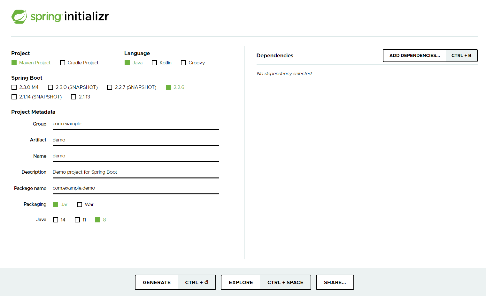

在 **IDEA** 的社区版本中是没有 **Spring Initializr** 这个选项的，没关系 Spring 官方提供了一个网页自动构建 **SpringBoot**脚手架的工具。

地址：https://start.spring.io/

### 配置

左边部分是选择项目的基本信息包括了 ：

- 构建方法
- 语言
- SpringBoot 版本
- 项目基本信息
- JDK版本

根据自身情况选择就好

### 下载

肉眼可见的一个 **Generate** 按钮，或者可以快捷键 **CTRL + 回车**	

下载完成后将 **ZIP** 文件解压并将文件夹放置项目目录

### 在 IDEA 中打开

打开后首先会自动构建依赖，要做的就是等... 

记得配置 **Maven** 的仓库配置文件