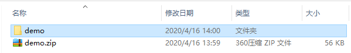
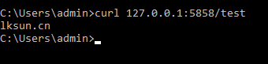

在 **IDEA** 的社区版本中是没有 **Spring Initializr** 这个选项的，没关系 Spring 官方提供了一个网页自动构建 **SpringBoot**脚手架的工具。

地址：https://start.spring.io/

### 配置


左边部分是选择项目的基本信息包括了 ：

- 构建方法
- 语言
- SpringBoot 版本
- 项目基本信息
- JDK版本

根据自身情况选择就好


### 下载

肉眼可见的一个 **Generate** 按钮，或者可以快捷键 **CTRL + 回车**	

下载完成后将 **ZIP** 文件解压并将文件夹放置项目目录




### 在 IDEA 中打开

打开后首先会自动构建依赖，要做的就是等... 

记得配置 **Maven** 的仓库配置文件

这时候就要等一个 `Build completed successfull`

### 启动

 点击 **Run DemoApplication** 启动

你以为事情结束了？还差一点

控制台会启动失败并返回

```java
No active profile set, falling back to default profiles: default
Started DemoApplication in 1.071 seconds (JVM running for 3.623)
```
此时只需要在`pom.xml`中添加
```xml
<dependency>
    <groupId>org.springframework.boot</groupId>
    <artifactId>spring-boot-starter-web</artifactId>
</dependency>
```


### 测试

创建如下一个方法

```java
@RestController
public class TestController {
    @GetMapping("/test")
    String index(){
        return "lksun.cn";
    }
}

```

请求一下 （因为我的默认8080被占用改成了5858端口）

