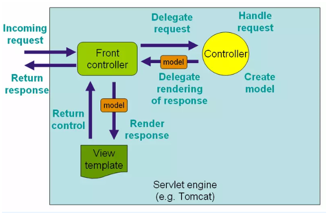

## 简介
`@RequestMapping` 是 Spring Web 应用程序中最常被用到的注解之一。这个注解会将 HTTP 请求映射到 MVC 和 REST 控制器的处理方法上。
## Request Mapping 基础用法
在 Spring MVC 应用程序中，RequestDispatcher (在 Front Controller 之下) 这个 servlet 负责将进入的 HTTP 请求路由到控制器的处理方法。

在对 Spring MVC 进行的配置的时候, 你需要指定请求与处理方法之间的映射关系。


### @RequestMapping 来处理多个 URI
```java
@RestController
@RequestMapping("/user ")
public class IndexController {

    @RequestMapping(value = {
		"",
		"/page ",
		"page* ",
		"view/*",
		"**/msg "
    })
    String show() {
        return "Hello";
    }
}
```

### 带有 @RequestParam 的 @RequestMapping
- `@RequestParam` 注解配合 @RequestMapping 一起使用，可以将请求的参数同处理方法的参数绑定在一起。

- `@RequestParam` 注解使用的时候可以有一个值，也可以没有值。这个值指定了需要被映射到处理方法参数的请求参数, 代码如下所示：


```java
@RestController
@RequestMapping("/home ")
public class IndexController {

    @RequestMapping(value = "/id ")
    String getIdByValue(@RequestParam("id") String personId) {
        System.out.println("ID is  " + personId);
        return "Get ID from query string of URL with value element ";
    }

    @RequestMapping(value = "/personId ")
    String getId(@RequestParam String personId) {
        System.out.println("ID is  " + personId);
        return "Get ID from query string of URL without value element ";
    }
}
```


### 用 @RequestMapping 处理 HTTP 的各种方法[GET、POST、PUT、UPDATE、DELETE...]

```JAVA
@RestController
@RequestMapping("/home ")
public class IndexController {
	
    @RequestMapping(method = RequestMethod.GET)
    String get() {
        return "Hello from get ";
    }
	
    @RequestMapping(method = RequestMethod.DELETE)
    String delete() {
        return "Hello from delete ";
    }
	
    @RequestMapping(method = RequestMethod.POST)
    String post() {
        return "Hello from post ";
    }
	
    @RequestMapping(method = RequestMethod.PUT)
    String put() {
        return "Hello from put ";
    }
	
    @RequestMapping(method = RequestMethod.PATCH)
    String patch() {
        return "Hello from patch ";
    }
}
```

### 使用 @RequestMapping 来处理消息头

-	@RequestMapping 注解提供了一个 header 元素来根据请求中的消息头内容缩小请求映射的范围。

-	在可以指定 header 元素的值，用 myHeader = myValue 这样的格式：

```JAVA
@RestController
@RequestMapping("/home ")
public class IndexController {
    @RequestMapping(value = "/head ", headers = {
        "content-type=text/plain "
    })
    String post() {
        return "Mapping applied along with headers ";
    }
}
```


### 使用 @RequestMapping 来处理请求参数
-	@RequestMapping 直接的 params 元素可以进一步帮助我们缩小请求映射的定位范围。
-	使用 params 元素，你可以让多个处理方法处理到同一个URL 的请求, 而这些请求的参数是不一样的。
-	你可以用 myParams = myValue 这种格式来定义参数，也可以使用通配符来指定特定的参数值在请求中是不受支持的。
```java
@RestController
@RequestMapping("/home ")
public class IndexController {
	
    @RequestMapping(value = "/fetch ", params = {
        "personId=10 "
    })
    String getParams(@RequestParam("personId ") String id) {
        return "Fetched parameter using params attribute =  " + id;
    }
	
    @RequestMapping(value = "/fetch ", params = {
        "personId=20 "
    })
    String getParamsDifferent(@RequestParam("personId ") String id) {
        return "Fetched parameter using params attribute =  " + id;
    }
}
```

在这段代码中，getParams() 和 getParamsDifferent() 两个方法都能处理相同的一个 URL (/home/fetch) ，但是会根据 params 元素的配置不同而决定具体来执行哪一个方法。

例如，当 URL 是 /home/fetch?id=10 的时候, getParams() 会执行，因为 id 的值是10,。对于 localhost:8080/home/fetch?personId=20 这个URL, getParamsDifferent() 处理方法会得到执行，因为 id 值是 20。


### 使用 @RequestMapping 处理动态 URI

-	@RequestMapping 注解可以同 @PathVaraible 注解一起使用，用来处理动态的 URI，URI 的值可以作为控制器中处理方法的参数。
-	你也可以使用正则表达式来只处理可以匹配到正则表达式的动态 URI。

```java
@RestController
@RequestMapping("/home ")
public class IndexController {
    @RequestMapping(value = "/fetch/{id} ", method = RequestMethod.GET)
    String getDynamicUriValue(@PathVariable String id) {
        System.out.println("ID is  " + id);
        return "Dynamic URI parameter fetched ";
    }
    @RequestMapping(value = "/fetch/{id:[a-z]+}/{name} ", method = RequestMethod.GET)
    String getDynamicUriValueRegex(@PathVariable("name ") String name) {
        System.out.println("Name is  " + name);
        return "Dynamic URI parameter fetched using regex ";
    }
}

```
在这段代码中，方法 getDynamicUriValue() 会在发起到 localhost:8080/home/fetch/10 的请求时执行。这里 getDynamicUriValue() 方法 id 参数也会动态地被填充为 10 这个值。

方法 getDynamicUriValueRegex() 会在发起到 localhost:8080/home/fetch/category/shirt 的请求时执行。不过，如果发起的请求是 /home/fetch/10/shirt 的话，会抛出异常，因为这个URI并不能匹配正则表达式。

@PathVariable 同 @RequestParam的运行方式不同。你使用 @PathVariable 是为了从 URI 里取到查询参数值。换言之，你使用 @RequestParam 是为了从 URI 模板中获取参数值。


### @RequestMapping 默认的处理方法

在控制器类中，你可以有一个默认的处理方法，它可以在有一个向默认 URI 发起的请求时被执行。

下面是默认处理方法的示例：
```java
@RestController
@RequestMapping("/home ")
public class IndexController {
    @RequestMapping()
    String
    default () {
        return "This is a default method for the class ";
    }
}
```

在这段代码中，向 /home 发起的一个请求将会由 default() 来处理，因为注解并没有指定任何值。