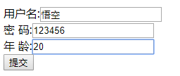
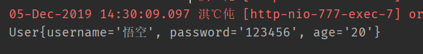

### User
```java
package cn.lksun.domain;

public class User {

    public String username;
    public String password;
    public String age;

    public String getUsername() {
        return username;
    }

    public void setUsername(String username) {
        this.username = username;
    }

    public String getPassword() {
        return password;
    }

    public void setPassword(String password) {
        this.password = password;
    }

    public String getAge() {
        return age;
    }

    public void setAge(String age) {
        this.age = age;
    }

    @Override
    public String toString() {
        return "User{" +
                "username='" + username + '\'' +
                ", password='" + password + '\'' +
                ", age='" + age + '\'' +
                '}';
    }
}


```
### ActionController
```java
package cn.lksun.controller;

import cn.lksun.domain.User;
import org.springframework.stereotype.Controller;
import org.springframework.web.bind.annotation.RequestMapping;
import org.springframework.web.bind.annotation.RequestMethod;
import org.springframework.web.bind.annotation.ResponseBody;

@Controller
@RequestMapping("/action")
public class ActionController {
    @RequestMapping(value = "/index",method = RequestMethod.GET)
    public String index(User user){
        System.out.println(user.toString());
        return user.toString();
    }
}
```

### form
```html
<form action="/action/index" method="get">
    用户名:<input type="text" name="username"><br/>
    密码:<input type="text" name="password"><br/>
    年龄:<input type="text" name="age"><br/>
    <input type="submit" value="提交">
</form>
```

### 测试 


在表单中随便填写数据,在控制台看到我们想要的数据了
