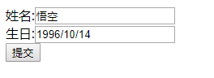
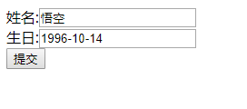

## 准备工作
### 第一步:创建一个表单
```html
<form action="/birthday" method="get">
    姓名:<input type="text" name="name"><br/>
    生日:<input type="text" name="birthday"><br/>
    <input type="submit" value="提交">
</form>
```
### 第二步:创建一个Birthday控制器
```java
package cn.lksun.controller;

import org.springframework.stereotype.Controller;
import org.springframework.web.bind.annotation.RequestMapping;
import org.springframework.web.bind.annotation.ResponseBody;

import java.util.Date;
import java.util.HashMap;
import java.util.Map;

@Controller
public class BirthdayController {
    @ResponseBody
    @RequestMapping("/birthday")
	// 注意,参数这里我们接受的事Date类型  不是字符串
    public String index(String name, Date birthday){
        Map<String,String> result = new HashMap<String, String>();
        result.put("name",name);
        result.put("birthday",birthday.toString());
        return result.toString();
    }
}

```

## 测试
-	名字随便写就好,生日写的是YYYY/MM/DD格式,得到的结果是
	
{birthday=Mon Oct 14 00:00:00 CST 1996, name=悟空}


-	但是生日写成YYYY-MM-DD格式后就出现了500错误


HTTP Status 500 – Internal Server Error
Failed to convert value of type 'java.lang.String' to required type 'java.util.Date'; nested exception is java.lang.IllegalStateException: Cannot convert value of type 'java.lang.String' to required type 'java.util.Date': no matching editors or conversion strategy found

### 总结
原因很简单,Spring帮我们做了类型转换将String=>Date,因为不识别YYYY-MM-DD格式便出现了500的报错


## 自定义类型转换器