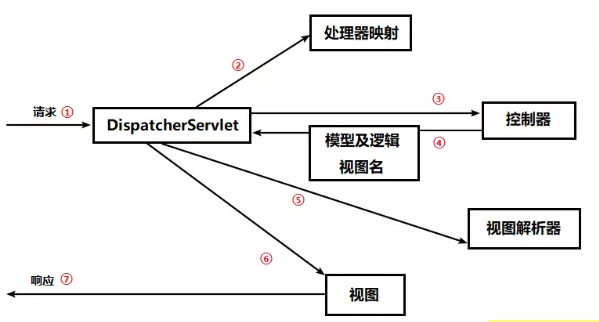
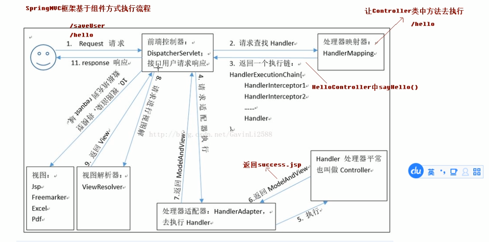

## 简介
每当用户在 Web 浏览器中点击链接或者提交表单的时候，请求就开始工作了，像是邮递员一样，从离开浏览器开始到获取响应返回，它会经历很多站点，在每一个站点都会留下一些信息同时也会带上其他信息，下图为 Spring MVC 的请求流程：
### 图一


### 图二


## 第一站：DispatcherServlet
从请求离开浏览器以后，第一站到达的就是 DispatcherServlet，看名字这是一个 Servlet，通过 J2EE 的学习，我们知道 Servlet 可以拦截并处理 HTTP 请求，DispatcherServlet 会拦截所有的请求，并且将这些请求发送给 Spring MVC 控制器。

```java
<servlet>
    <servlet-name>springmvc</servlet-name>
    <servlet-class>org.springframework.web.servlet.DispatcherServlet</servlet-class>
</servlet>

<servlet-mapping>
    <servlet-name>springmvc</servlet-name>
    <url-pattern>/</url-pattern>
</servlet-mapping>
```
- **DispatcherServlet 的任务就是拦截请求发送给 Spring MVC 控制器。**


## 第二站：处理器映射（HandlerMapping）
- **问题： 典型的应用程序中可能会有多个控制器，这些请求到底应该发给哪一个控制器呢？**
所以 DispatcherServlet 会查询一个或多个处理器映射来确定请求的下一站在哪里，处理器映射会根据请求所携带的 URL 信息来进行决策，例如上面的例子中，我们通过配置 simpleUrlHandlerMapping 来将 /hello 地址交给 helloController 处理


- **联想：此处类似于PHP很多框架中的路由**

```java
<bean class="org.springframework.web.servlet.handler.BeanNameUrlHandlerMapping" />
<bean class="org.springframework.web.servlet.mvc.SimpleControllerHandlerAdapter" />
<bean name="/hello" class="cn.lksun.controller.MyController"/>
```


## 第三站：控制器
一旦选择了合适的控制器， DispatcherServlet 会将请求发送给选中的控制器，到了控制器，请求会卸下其负载（用户提交的请求）等待控制器处理完这些信息：
```java
public class MyController implements Controller {
    public ModelAndView handleRequest(javax.servlet.http.HttpServletRequest request, javax.servlet.http.HttpServletResponse response) throws Exception {
        System.out.println("hello Spring-MVC");
        request.setAttribute("name","canon");
        ModelAndView modelAndView = new ModelAndView();
        modelAndView.setViewName("/hello.jsp");
        return modelAndView;
    }
}
```

## 第四站：返回 DispatcherServlet
第四站：返回 DispatcherServlet
当控制器在完成逻辑处理后，通常会产生一些信息，这些信息就是需要返回给用户并在浏览器上显示的信息，它们被称为模型（Model）。仅仅返回原始的信息时不够的——这些信息需要以用户友好的方式进行格式化，一般会是 HTML，所以，信息需要发送给一个视图（view），通常会是 JSP。
控制器所做的最后一件事就是将模型数据打包，并且表示出用于渲染输出的视图名（逻辑视图名）。它接下来会将请求连同模型和视图名发送回 DispatcherServlet。
```java
 ModelAndView modelAndView = new ModelAndView();
modelAndView.setViewName("/hello.jsp");
return modelAndView;
```


## 第五站：视图解析器
这样以来，控制器就不会和特定的视图相耦合，传递给 DispatcherServlet 的视图名并不直接表示某个特定的 JSP。（实际上，它甚至不能确定视图就是 JSP）相反，它传递的仅仅是一个逻辑名称，这个名称将会用来查找产生结果的真正视图。
DispatcherServlet 将会使用视图解析器（view resolver）来将逻辑视图名匹配为一个特定的视图实现，它可能是也可能不是 JSP


## 第六站：视图
既然 DispatcherServlet 已经知道由哪个视图渲染结果了，那请求的任务基本上也就完成了。

它的最后一站是视图的实现，在这里它交付模型数据，请求的任务也就完成了。视图使用模型数据渲染出结果，这个输出结果会通过响应对象传递给客户端。

```html
<%@ page contentType="text/html;charset=UTF-8" language="java" %>
<html>
<head>
    <title>Title</title>
</head>
<body>
    <h1>Hello Spring MVC</h1>

<h2>我是:${name}</h2>
</body>
</html>
```

## 参考
[Spring MVC【入门】就这一篇！](https://www.jianshu.com/p/91a2d0a1e45a "Spring MVC【入门】就这一篇！")